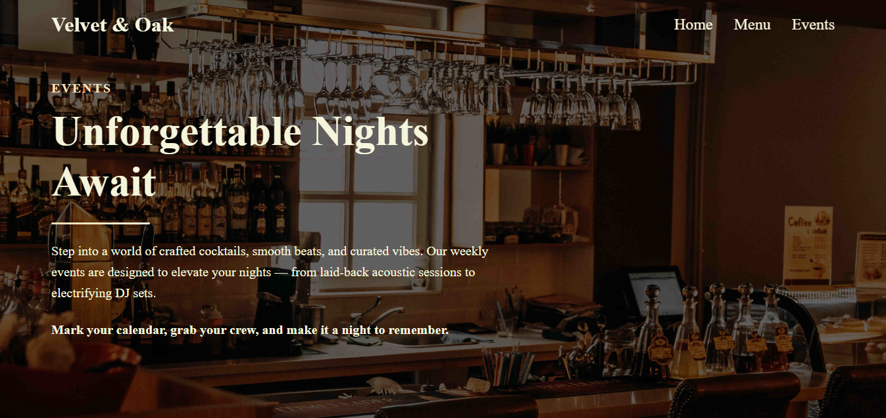

# Velvet & Oak – Bar Landing Page 🍸

Fictional landing page developed with Django for a modern bar with weekly events, elegant design and focus in user experience.

Landing page ficticia desarrollada con Django para un bar moderno con eventos semanales, diseño elegante y enfoque en experiencia de usuario.

## 📸 Preview



## 🚀 Features

- Responsive design with HTML5 and CSS3.
- Dinamyc listing of events from the database.
- Social media section with interactive icons.
- Modular and organized code.

## 🛠️ Stack used

- Python 3.x
- Django 4.x
- Bootstrap Icons
- PostgreSQL / Sqlite3

## ▶️ How to run locally

###  Linux / macOs
```bash
git clone https://github.com/quesoCosteno03/bar-landing-page.git
cd bar-landing-page
python -m venv venv
source venv/bin/activate
pip install -r requirements.txt
cd src
python manage.py migrate
python manage.py runserver
```

### Windows

```powershell
git clone https://github.com/quesoCosteno03/bar-landing-page.git
cd bar-landing-page
python -m venv venv
.\venv\Scripts\Activate.ps1
pip install -r requirements.txt
cd src
python manage.py migrate
python manage.py runserver
```

